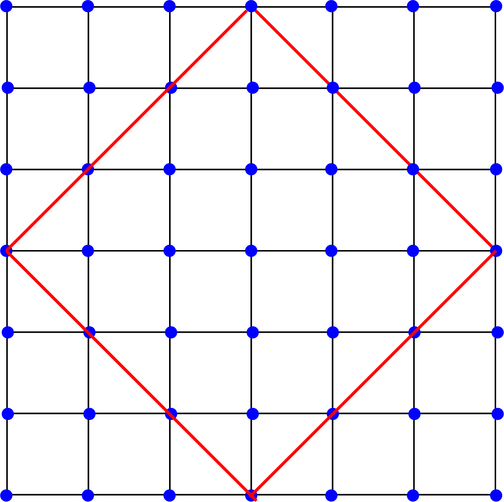

这里想整理利用VASP的POSCAR来构建一个实空间的点阵,在构建出实空间的点阵上再进行一些其他的操作.
{:.info}
<!--more-->
# 前言
在学习固体物理的过程中,其实实空间中的点阵就是利用晶格矢量来构建实空间中的周期晶格的,公式如下

$$
\mathbf{R}=i\cdot\mathbf{a}_1+j\cdot\mathbf{a}_2+k\cdot\mathbf{a}_3\quad i,j,k\in\mathbb{Z}
$$

这里的$\mathbf{a}_1,\mathbf{a}_2,\mathbf{a}_3$就是实空间中的元胞基矢,自己在之前的学习过程中,经常使用到的都是在正方点阵上的模型研究,也就是说

$$
\mathbf{a}_1=(1,0,0)\quad\mathbf{a}_2=(0,1,0)\quad\mathbf{a}_3=(0,0,1)
$$

在这种情况下其实也不太需要使用晶格基矢来构建点阵,但是如果涉及到的是其它形状的点阵,比如graphene的点阵,如果还是用正方点阵的思路来构造格点,那么在选择最近邻和次近邻的时候,格点索引并不是很方便,所以如何是利用晶格基矢来构建实空间的点阵,那么最近邻和次近邻只需要关注距离就可以,而不用取关心比较复杂的格点的索引,通过点阵之间的距离再反推其对应的索引,就可以比较方便的建实空间的哈密顿量.

# 读取POSCAR

```python
import numpy as np
def Read_POSCAR():
    file = open('POSCAR')
    comment = file.readline() # 第一行是注释，用来解释说明这个体系是啥
    lattice_constant = file.readline() # 第二行是晶格常数
    v1 = file.readline() # 第3，4，5行是三个晶格基矢
    v2 = file.readline() 
    v3 = file.readline() 
    v1 = [float(x) for x in v1.strip().split()] # 将读取到的字符串晶格矢量转换成浮点数
    v2 = [float(x) for x in v2.strip().split()]
    v3 = [float(x) for x in v3.strip().split()]
    basis_vec = np.array([v1,v2,v3]) # 存储三个晶格矢量
    atom_Name = file.readline().strip().split() # 读取POSCAR中的原子名称
    atom_Number = [int(x) for x in file.readline().strip().split()] # 获取每个原子对应的数目
    coor_style = file.readline().strip() # 读取原子位置存储坐标架形式(直角坐标还是分数坐标)
    atom_pos = []
    a1 = file.readlines()
    pos_list = [] # 存储所有原子的位置
    for i0 in range(len(a1)):
        re1 = [float(x) for x in (a1[i0].strip()).split()]
        pos_list.append(re1)
    pos_list = np.array(pos_list) # 将列表转换成数组
    return basis_vec,pos_list
```

- POSCAR
```shell
Li2 Fe2 As2
1.0
        3.7906289101         0.0000000000         0.0000000000
        0.0000000000         3.7906289101         0.0000000000
        0.0000000000         0.0000000000         6.1074509621
   Li   Fe   As
    2    2    2
Direct
     0.000000000         0.500000000         0.168968007
     0.500000000         0.000000000         0.831031978
     0.000000000         0.000000000         0.500000000
     0.500000000         0.500000000         0.500000000
     0.000000000         0.500000000         0.725714028
     0.500000000         0.000000000         0.274286002
```

# 利用晶格矢量构建点阵

在得到了晶格基矢之后，构建点阵自然就是利用晶体的周期性

$$
(R_i,R_j,R_k)=i\cdot\mathbf{a}_1+j\cdot\mathbf{a}_2+k\cdot\mathbf{a}_3\quad i,j,k\in\mathbb{Z}
$$

这里不想搞的非常复杂，所以就简单的考虑二维的点阵
```python
import numpy as np
def Lattice():
    file = open('POSCAR')
    comment = file.readline() # 第一行是注释，用来解释说明这个体系是啥
    lattice_constant = file.readline() # 第二行是晶格常数
    v1 = file.readline() # 第3，4，5行是三个晶格基矢
    v2 = file.readline() 
    v3 = file.readline() 
    v1 = [float(x) for x in v1.strip().split()] # 将读取到的字符串晶格矢量转换成浮点数
    v2 = [float(x) for x in v2.strip().split()]
    v3 = [float(x) for x in v3.strip().split()]
    basis_vec = np.array([v1,v2,v3]) # 存储三个晶格矢量
    atom_Name = file.readline().strip().split() # 读取POSCAR中的原子名称
    atom_Number = [int(x) for x in file.readline().strip().split()] # 获取每个原子对应的数目
    total_atom_Number = np.sum(atom_Number)
    coor_style = file.readline().strip() # 读取原子位置存储坐标架形式(直角坐标还是分数坐标)
    atom_pos = []
    a1 = file.readlines()
    pos_list = [] # 从POSCAR中读取原子位置，存储所有原子的位置
    for i0 in range(len(a1)):
        re1 = [float(x) for x in (a1[i0].strip()).split()]
        pos_list.append(re1)
    pos_list = np.array(pos_list) # 将列表转换成数组

    # 已经得到了晶格的基矢，那么就可以利用这些基矢来构建来构建实空间上的格点
    nx = 20
    ny = nx
    point_list = np.zeros(((nx*2)**2*total_atom_Number, 6)) # 先构建一个点阵，每个格点上面包含原子数目这个自由度(*atom_number)
    # 这里有个*2是因为下面取格点位置的时候使用了-nx，nx
    ind = 0
    for ix in range(-nx,nx):
        for iy in range(-ny,ny):
            pos = ix*basis_vec[0,0:3] + iy*basis_vec[1,0:3]
            # 这里存储每个格点在实空间中的位置，并且加上了原子在格点上的位置，并且分别给每个格点赋予了一个index
            point_list[ind*total_atom_Number:(ind + 1)*total_atom_Number, 0:3] = np.add(pos_list[:,0:3] ,pos) # 格点位置加原子位置
            point_list[ind*total_atom_Number:(ind + 1)*total_atom_Number, 3] = ix # 格点x方向索引
            point_list[ind*total_atom_Number:(ind + 1)*total_atom_Number, 4] = iy # 格点y方向索引
            point_list[ind*total_atom_Number:(ind + 1)*total_atom_Number, 5] = ind # 格点索引
            ind += 1
            # 再给每个格点赋予了index和实空间位置之后，之后就可以通过直接寻找格点在实空间中的位置，从而得到其索引，反过来也可以直接通过
            # 索引来找到这个格点在实空间中的位置
    # 这里不仅给每一个格点编号,而且每个格点对应在实空间中的直角坐标的位置同样知道了,这里初步构建的时候是给定了一个x,y方向格点数都是相同的
    # 如果想得到一个其他形状的格点,那么只需要在实空间的坐标上将满足条件范围内的格点,从实空间的位置上选定出来,这样就可以得到选定范围内的坐标
    # 从而选择出想要的格点在原本正方格点上对应的index
```
下面就从一个正方的点阵上沿着$45^\circ$方向来截取一个新的形状的点阵,结构如下



通过函数关系就可以得到要想将格点限定在上面的红色实线所包围的区域中,$x$方向的坐标和$y$方向的坐标满足的关系为

$$
\begin{aligned}
&x + y < \text{len}\\
&x + y > -\text{len}\\
&x - y > -\text{len}\\
&x - y < \text{len}\\
\end{aligned}
$$

这里的$\text{len}$就是截取格点的点阵大小,结果示意图如下,长度为$\text{len} = 1$.


将这个区域通过代码实现，也即是要求在前面构建的点阵中，找到$(x,y)$满足要求的点阵，在代码中用`point_list`存储了点阵的实空间坐标以及格点对应的索引，
因此可以直接利用点阵的$(x,y)$坐标的信息来筛选出满足要求的格点
```python
cut_size = 10 # 设置选取点阵的大小
p1 = point_list[:,0] < -point_list[:,1] + cut_size
p2 = point_list[:,0] < -point_list[:,1] - cut_size
p3 = point_list[:,0] > point_list[:,1] - cut_size
p4 = point_list[:,0] < point_list[:,1] + cut_size
cut_points = np.where(p1&p2&p3&p4)[0] # 通过比较获得满足条件的格点的位置
```
从上面的示意图可以看出，当选择$len=1$的时候，在原有的点阵中获取新的点阵的时候，最大的位置就是$len$，因此在这里可以通过变量来控制选择的新点阵的大小。这里通过比较的方法会获得一系列的逻辑值，那么想要得到索引就通过选择结果的$Ture$来得到满足条件的格点的索引。

下面来分析一下可能得到的结果，首先从POSCAR文件中可以看到，每个原胞中有6个原子，那么将一个原胞看作是一个格点，每个格点的自由度就是6

$$
\psi_i=(c_{ia},c_{ib},c_{ic},c_{id},c_{ie},c_{if})
$$

这里的$i$表示的就是格点的index，而$a,b,c,d,e,f$则用来表示格点中的内部自由度，这里指的就是原胞中的6个原子，