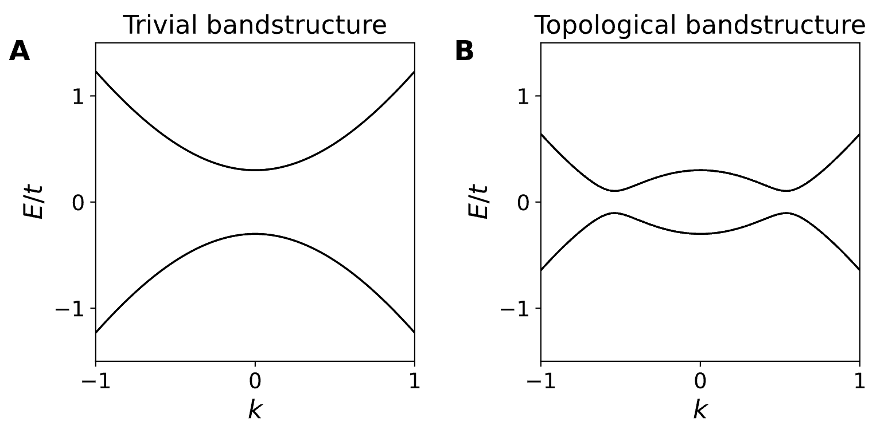
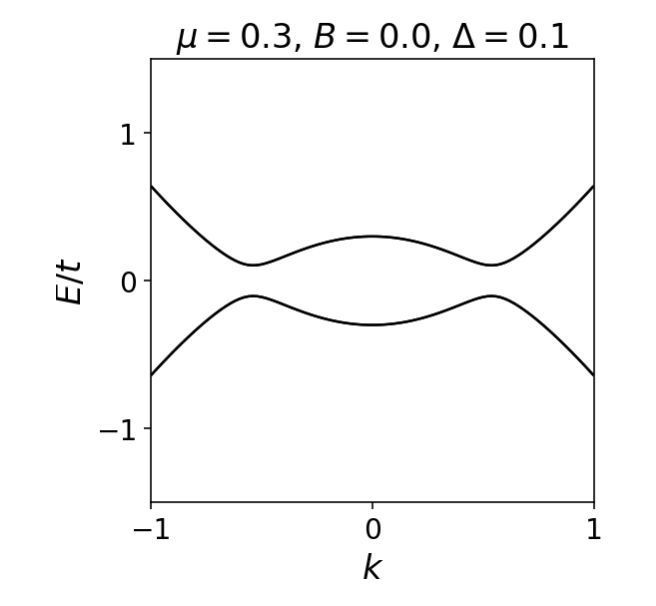
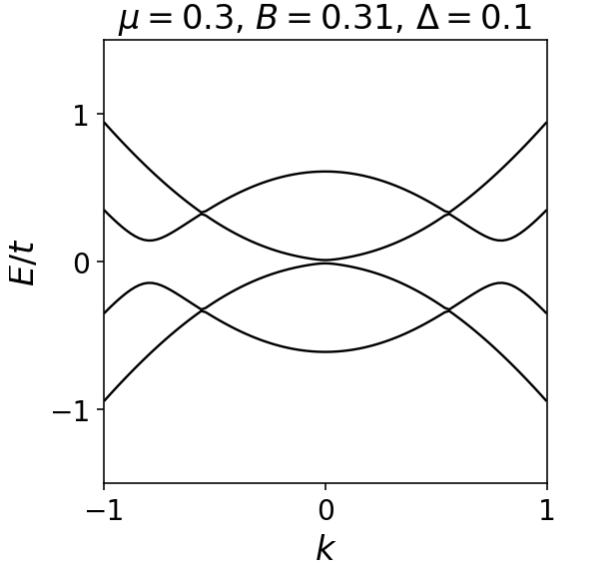
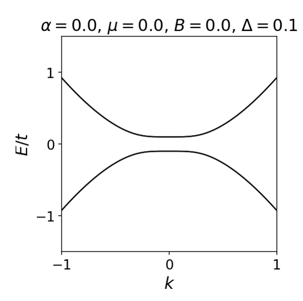
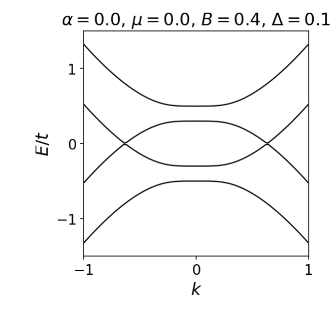
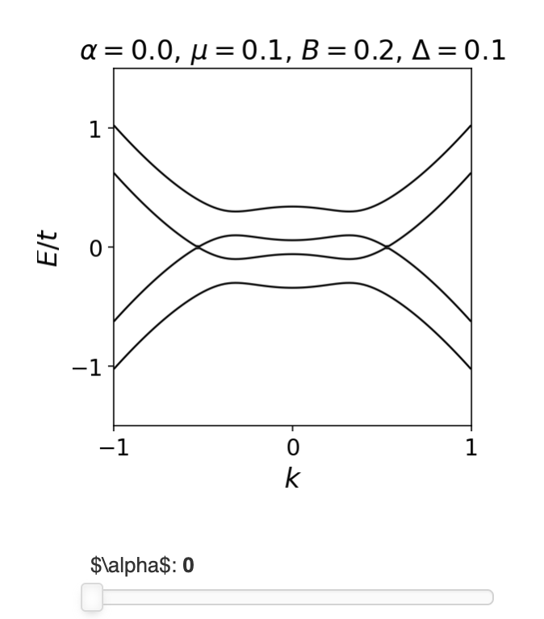
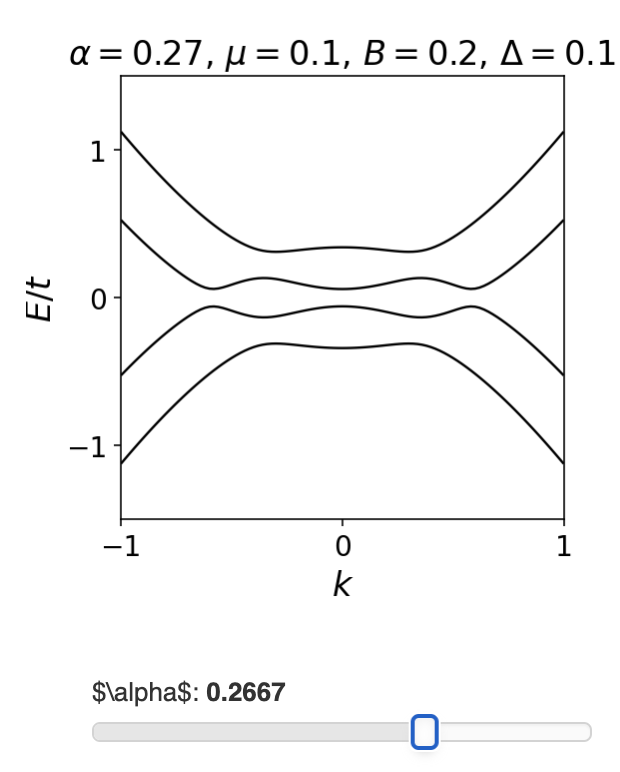

最近正好有些空闲的时间，发现自己对拓扑中的一些理解并不深刻，正好借这个机会重新学习一下，加深自己对其中内容的理解，也能让自己之后的研究走的更远。
{:.info}
<!--more-->

# From Kitaev model to an experiment
在前面的章节中，学习了1D Kitaev链的边界处可以实现Majorana模式，这也只是一个toy model，下面就来讨论一下如何在真实的系统中来实现这个模型。处理这个问题的方法是把Kitaev链看作一个“骨架”，用真实的物理现象“装扮”它，直到它变成真实的。首先来看我们研究的“骨架”，Kitaev模型在动量空间中为

$$
H_{Kitaev} = (-2 t \cos k -\mu) \tau_z + 2 \Delta \tau_y \sin k.
$$

这个模型似乎可以作为一个开始，因为它存在超导电子配对$\Delta$和由$\mu$和$t$成比例的项给出的正常色散。在我们进一步讨论之前，先了解一下这些参数之间的关系。首先，我们要做一个可控的系统，这样
我们就可以调节它的参数。这意味着我们需要一种半导体。在半导体中，电子密度很低，因此化学势接近能带的底部。这使得定义$\mu$相对于能带底部更容易:

$$
\mu \rightarrow \mu - 2t.
$$

其实就是将能带底作为化学势的零点参考点，这与牛顿力学里面，通常在处理问题的时候也会选定一个零势能参考点的想法是一样的。在重新定了化学势之后，那么平庸相和非平庸相的分离点就是$\mu=0$。

虽然半导体从来都不是超导体。幸运的是，这很容易解决。我们只是把超导体和半导体粘贴到一个混合结构中(异质结)，然后让超导体在半导体中诱导超导电性。从材料科学的角度来看，制造这种混合材料是极具挑战性的，但这绝对不是我们目前的问题(目前来看，实验确实在这方面遇到了很严重的问题)。

下一步就是考虑化学势与带宽相比是比较小的$\mu\ll 2t$，在超导体中同样有$\Delta\ll t$。这是因为与电子动能相比，超导电性是非常小的。将上面的这两个不等式结合起来，可以将$\cos k$项进行展开，可以在低能连续情况下处理Kitaev模型

$$
H = (k^2/2m - \mu) \tau_z + 2 \Delta \tau_y k.
$$

这里的有效质量$m$是展开系数，在拓扑相和平庸相时体系的能带微

# The need for spin
尽管如此，这个模型仍然缺少一个明显的东西，即电子自旋。这个模型适用于一些假设的无旋费米子(spinless,其实就是说当电子自旋在这个系统中不起明显作用，就忽略自旋，认为系统是spinless)，这些费米子实际上并不存在。为了使模型物理化，我们需要记住每个粒子都有自旋，哈密顿量在自旋空间中有一些作用，用泡利矩阵$\sigma$来描述。我们能做的最简单的事就是把自旋作为一个额外的简并，也就是把哈密顿量中的每一项乘以$\sigma_0$。显然这不会改变能谱谱，零能量的解仍然是零能量的解。
实际上，在考虑了自旋之后，事情就变的很不一样了。关于添加自旋的问题是，Kitaev链的全部要点是创建“未配对”的马约拉纳模式。如果我们给这些马约拉纳子加上一个额外的自旋简并度，我们链的边缘就会有两个马约拉纳子，或者换句话说，一个正则费米子被微调到零能量。此时因为没有时间反演对称性保护，所以每个边缘上面的两个Majorana费米子就会相互耦合，形成一个真实的电子，所以边界上也就并不会存在零能模了。

那么如何正确的引入自选，且同样可以实现Majorana零能模？首先一定要加入自旋，虽然在有些体系中自旋可能不重要，但是你不能回避说体系就没有自旋，只要可以令一种自旋的Kitaev链处于平庸相，另外一种自旋的Kitaev链处于非平庸相，那么本质上就还是在体系中可以实现Majorana模式。通过前面的分析知道化学势$\mu$控制着Kitaev链是拓扑的还是平庸的，所以如果自旋向上的值为$\mu > 0$，自旋向下的值为$\mu < 0$，那么就对某一支自旋的Kitaev链实现了Majorana模式。我们通过将自旋与外部磁场的Zeeman耦合来实现：

$$
H = (k^2/2m - \mu - B \sigma_z) \tau_z + 2 \Delta \tau_y k.
$$

每当塞曼能量$|B|$大于$\mu$时，链的末端就有一个Majorana费米子。这里来看一下随着Zeeman场的变化，能带色散是如何演变的

随着Zeeman场变大，其中一支自旋对应的能带在$\mu=\rvert B\rvert$会发生拓扑相变，另外一支能带则会慢慢劈开，最终就会使得只有一支是拓扑的，那么就可以实现Majorana模式。
# Realistic superconducting pairing
接下来考虑超导体中的电子配对。可以看到在Kitaev链哈密顿量中超导电子配对$\Delta$有一种特殊的形式。它对来自相邻位置的电子，而不是来自同一位置的电子。在动量空间中，这意味着超导配对与$\Delta k$成正比。`当然，在Kitaev链中，超导配对不能使来自同一位点的两个电子成对，因为每个位点只有一个粒子。` 真实的超导体是不同的。它们中的大多数，特别是所有常见的超导体，如$Al$， $Nb$， $Pb$， $Sn$都有$s$-波对。这意味着配对不依赖动量，在实空间中是局部(on-site配对)的。Kitaev链配对与动量的一次方成正比，所以它是一个$p$波配对。虽然[高温超导体](https://en.wikipedia.org/wiki/High-temperature_superconductivity)，如铜酸盐或pnictides有动量依赖配对，但它是另一种类型($d$-波，或更奇特的$s\pm$-波)。

所以如果想发明一种制造Majorana的方法，我们就需要使用$s$-wave配对。然后，在之前的章节中讨论过，根据费米子统计关系，配对函数应该是反对称的。在Kitaev链中，反对称是由于电子配对在实空间的结构反应的，但在$s$波超导体中，电子配对的反对称是由于其自旋结构引起的。**其实就是说$p$波配对其自旋部分是三重态配对，要满足Pauli不相容原理，那么空间部分就一定会是奇宇称的；而$s$波配对自旋部分是单重态配对，此时要满足Pauli不相容原理，空间部分就是偶宇称的，而$s$波本来就是动量不相关的。** 

这就只剩下一个选择了。所有的$s$波超导体都是自旋单态的:

$$
H_{pair} = \Delta(c_\uparrow c_\downarrow - c_\downarrow c_\uparrow) + \text{h.c.}
$$

很显然，需要通过一定的方法能修改电子配对形式，否则就不能实现Kitaev模型。
## Important and useful basis change.
当你在文献中看到BdG哈密顿量的时候，会发现它们是在两种不同的基矢下面表示的。其中一种形式在之前已经遇到过

$$
H_\textrm{BdG} = \begin{pmatrix} H & \Delta \\ -\Delta^* & -H^* \end{pmatrix}.
$$

它具有粒子空穴对称性$H_\textrm{BdG} = - \tau_x H^*_\textrm{BdG} \tau_x$。在这个基矢下面，$s$波电子配对正比与$\sigma_y$。然而，对于自旋和轨道结构比较复杂的系统，有一种不同的基矢选择，可以使得哈密顿量在形式上更加简洁。如果我们有一个时间反转对称算子$\mathcal{T} = U \mathcal{K}$，我们可以将幺正变换$U$作用到空穴部分，这样在新的基矢上我们就得到了BdG哈密顿量：

$$
H_\textrm{BdG} = \begin{pmatrix} H & \Delta' \\ \Delta'^\dagger & -\mathcal{T} H \mathcal{T}^{-1}\end{pmatrix},
$$

这里$\Delta' = \Delta U^\dagger$。那么这种新的基矢选择有什么优势？

* 首先，因为在这个新的基矢选择下面，不管我们考虑的是什么系统，$s$-波配对是一个单位矩阵。
* 第二，因为很容易得到空穴部分的哈密顿量。我们取电子的哈密顿量，改变所有符合时间反转对称性的项的符号，但不改变那些不符合时间反转对称性的项的符号，例如与磁场成比例的项$B$。如果电子的哈密顿量$H(B)$，空穴的哈密顿量就变成$-H(-B)$。

但有一个缺点。此时粒子-空穴的对称性算符现在变得更加复杂。对于只有一个轨道和自旋的系统，它是$\mathcal{P} = \sigma_y \tau_y \mathcal{K}$，但是这么做还是有很大的优势。

# s-wave superconductor with magnetic field
这里先来看一下，如果把电子配对换成$s$波，Kitaev链会变成怎样。Zeeman场在时间反演对称性会反号，这意味着如果用上面提到的第二种基矢来表示BdG哈密顿量，那么电子部分和空穴部分的Zeeman场形式是相同的，所以最终可以得到BdG哈密顿量为

$$
H_\textrm{BdG} = (k^2/2m - \mu)\tau_z + B \sigma_z + \Delta \tau_x.
$$

这个哈密顿量很容易对角化，因为每一项要么只有$\tau$矩阵，要么只有$\sigma$矩阵。在$k=0$时，它有4个能级，能量为$E = \pm B \pm \sqrt{\mu^2 + \Delta^2}$。我们可以用这个表达式来跟踪能带交叉点。我们还知道，当$B=0$时，由于自旋简并性，系统是平庸的。我们期望当

$$
B^2 > \Delta^2 + \mu^2.
$$

系统会处于非平庸相，但是我们还并没有完成这一步。
## Problem with singlets
单重态配对超导体有一个重要的性质：因为电子是在单重态配对中产生的，自旋部分携带的总角动量为零，所以每个激发的总自旋都是守恒的。塞曼场在$z$方向上保持自旋守恒，所以我们系统的每一个状态都必须有一个确定的自旋，包括**Majorana费米子**。因此这里有一个很大的问题。前面讨论过，`Majorana费米子是它自己的粒子空穴partner，这意味着它们不可能有任何自旋(能量、电荷或任何其他可观测属性)`。因此从这里来看，似乎破坏了体边对应关系，在来看一下体态的能带结构：

显然，这里并没有破坏体边对应。而Majorana模式在这里又会具有确定的自旋，这显然是不可能的。这反过来也就意味着此时必然是不会存在Majorana模式的，因为随着Zeeman场的增加，系统并没有打开gap。这里没有打开gap的原因也很好分析，在哈密顿量中可以发现，关于自旋的Pauli矩阵只出现了$\sigma_z$，这意味着此时自旋还是守恒量。因此当Zeeman场比较大的时候，交叉的两个能带分属于不同的自旋，因为这里自旋是个受衡量，所以始终会存在交叉，那么打开交叉的方式就是令自旋不守恒。

# How to open the gap?
通过上面的分析已经知道了，当加入足够强的Zeeman场之后，体系仍然是没有打开能隙是因为此时自旋是守恒的，而在上面的考虑中，其实可以认为磁场是沿着$z$方向的，因此如果想在保持Zeeman场不变的情况下打开能隙，那么就需要将不同的自旋混合起来，破坏自旋守恒。最简单的方法就是加入自旋轨道耦合，在1D链中[最简单的形式 ](https://en.wikipedia.org/wiki/Rashba_effect) 为

$$
H_{\rm SOC} = \alpha \sigma_y k,
$$

它很像一个指向$y$方向的Zeeman场，其大小与粒子的动量成正比。而且SOC项在时间反演对称操作下面是不变的(因为$\sigma_y$和$k$在时间反演操作下面都会反号)，现在就得到了最终的哈密顿量

$$
H_\textrm{wire} = (k^2/2m + \alpha \sigma_y k - \mu)\tau_z + B \sigma_z + \Delta \tau_x.
$$

在$k=0$的位置处，SOC消失，所以他并不会影响系统是拓扑的还是平庸的。通过能带计算发现，在考虑了Zeeman场和SOC之后

体系打开了能隙。

一个重要的注释：现在可能会认为SOC相互作用依赖于自旋，所以磁场就没有必要了。这是不对的。由于SOC并没有破坏时间反演对称性，在没有磁场的情况下，模型的能谱将具有Kramers简并。为了在每条边上得到一个而不是两个未配对的马约拉纳模，因此就需要破坏Kramers简并，从而打破时间反演对称性。因此需要塞曼场和SOC相结合。
{:.info}

# 公众号
相关内容均会在公众号进行同步，若对该Blog感兴趣，欢迎关注微信公众号。
{:.info}

