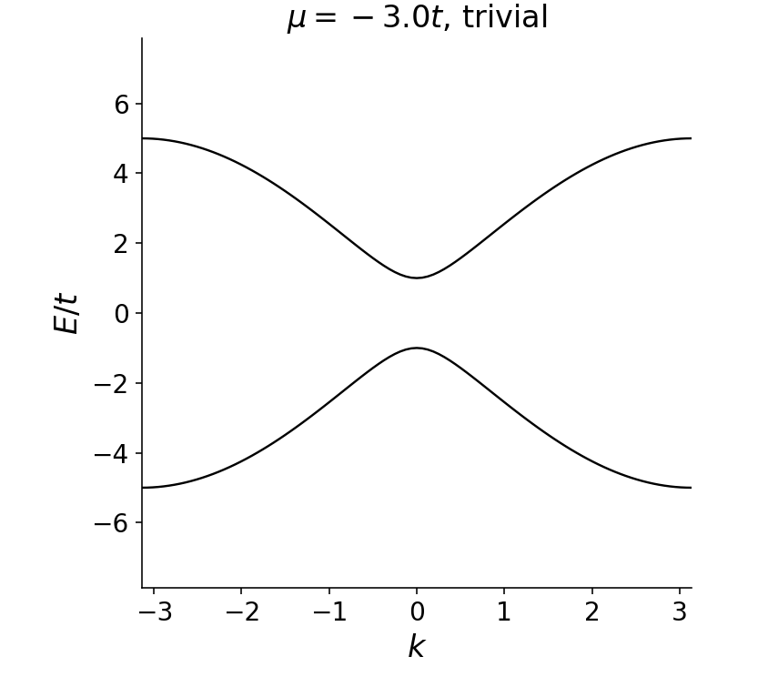
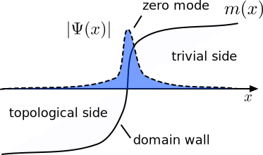
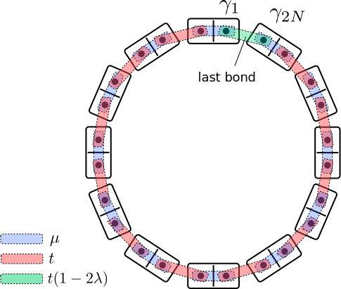
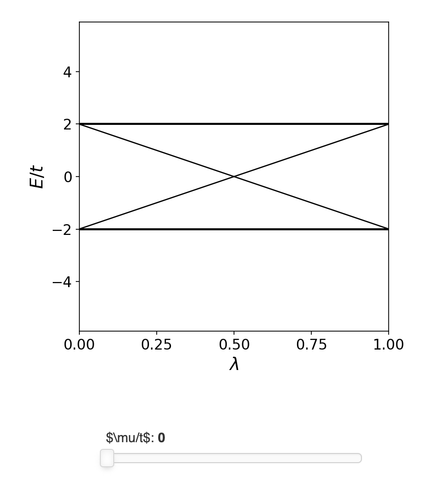
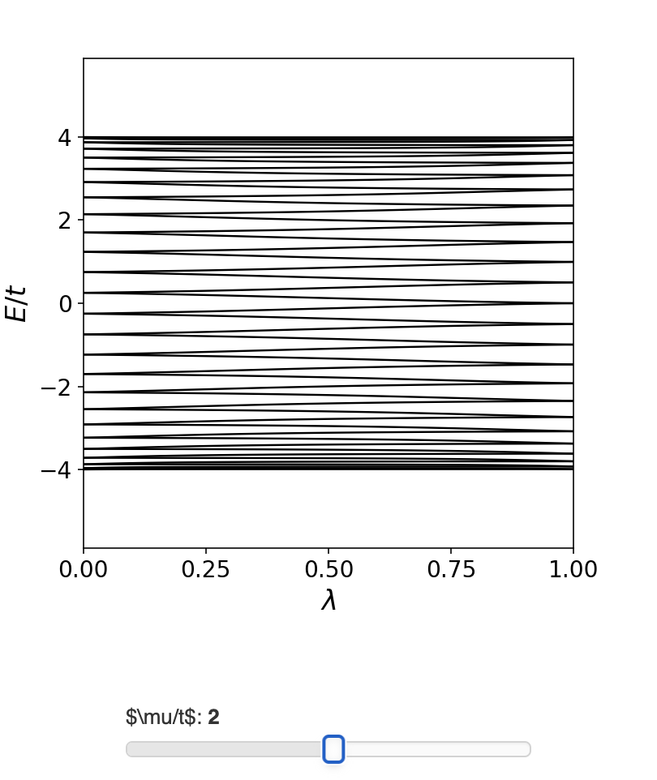

最近正好有些空闲的时间，发现自己对拓扑中的一些理解并不深刻，正好借这个机会重新学习一下，加深自己对其中内容的理解，也能让自己之后的研究走的更远。
{:.info}
<!--more-->

# Topological phases from the bulk spectrum
## Going to momentum space
从上面的分析可以看到，边界上的Majorana模式是受到体态能隙保护的，这是一种体边对应(bulk-edge correspondence)。这里就可以提出一个问题：**能否通过体态的来预测边界上Majorana模式的存在？** 为了回答这个问题，首先需要消除Kitaev链的边界，可以想象将Kitaev链的首尾相接，形成一个闭合的环(kitaev ring)，此时就不会存在边界了，那么BdG哈密顿量就满足平移对称性$\rvert n\rangle\rightarrow\rvert n+1\rangle$，而且此时所有的参数$\Delta,\mu,t$都是与位置无关的。当存在平移对称性之后，就可以利用前面提到过的[Bloch定理]((https://en.wikipedia.org/wiki/Bloch_wave#Preliminaries:_Crystal_symmetries.2C_lattice.2C_and_reciprocal_lattice))将BdG哈密顿量表示在动量空间中。一个动量为$k$的态既可以通过实空间中的态表示出来

$$
\rvert k\rangle =(N)^{-1/2} \sum_{n=1}^{N} e^{-ikn} \rvert n\rangle.
$$

这里再利用周期边界条件$\left\langle k | n=0 \rangle=\left\langle k | n=N \rangle$，此时动量$k$就是一个守恒量，它被允许在第一布里渊区中取值，如果此时实空间中的格点数量为$N$，那么$k$的取值为$2\pi p /N，p=0, 1, 2, \dots, N-1$。因为$k$是个好量子数，在动量空间中BdG哈密顿量就可以约化为$2\times 2$的矩阵形式

$$
H(k) \equiv \left\langle k\right| H_\textrm{BdG} \rvert  k \rangle = (-2t\cos{k}-\mu)\,\tau_z + 2\Delta \sin{k}\,\,\tau_y.
$$

完整的哈密顿量就是对这些离散的子块进行求和

$$
H_\textrm{BdG} = \sum_k H(k) \rvert  k \rangle\left\langle k \right|.
$$

当实空间中的链长$N\rightarrow+\infty$时，动量$k$就可以取连续值，遍历整个$k\in[-\pi,\pi]$。
## Particle-hole symmetry in momentum space
从实空间变换到动量空间中并不会影响体系的粒子空穴对称性，但是在进行Fourier变换的时候，还是需要分析一下粒子空穴反幺正操作对基矢的影响，因为它是一个反幺正操作，其中会包含了复共轭操作，因此基矢的选择会影响这个对称操作在动量空间中的形式。在当前的情况中

$$
\mathcal{P}\rvert k\rangle\otimes\rvert \tau\rangle = \left(\sum_n\,e^{-ikn}\right)^*\,\rvert n\rangle\otimes \tau_x\rvert \tau\rangle^*=\rvert -k\rangle\otimes\tau_x\rvert \tau\rangle^*.
$$

此时可以发现，粒子空穴对称操作会使得$k\rightarrow -k$，因此$\mathcal{P}$作用在BdG哈密顿量上，在动量空间中表示为

$$
\mathcal{P}H_\textrm{BdG}\mathcal{P}^{-1} = \sum_k \tau_xH^*(k)\tau_x \rvert  -k \rangle\left\langle -k \right|=\sum_k \tau_xH^*(-k)\tau_x \rvert  k \rangle\left\langle k \right|\,.
$$

在最后一个等号处，因为每一个允许的$k$值都是成对出现的$(k,-k)$，包括$k=0,\pi$这两点。所以粒子空穴对称性$\mathcal{P}H_\textrm{BdG}\mathcal{P}^{-1}= -H_\textrm{BdG}$在动量空间中就可以表示为

$$
H(k)=-\tau_xH^*(-k)\tau_x.
$$

对上面的模型同样可以验证这一点

$$
\tau_x H^*(-k) \tau_x = (2t\cos{k}+\mu)\,\tau_z - 2\Delta \sin{k}\,\,\tau_y.
$$

可以发现因为存在粒子空穴对称性，在$k$处如果存在能量为$E$的态，那么必然也会在$-k$处存在能量为$-E$的态。

## Band structure

到这里，我们只需要对动量空间中$2\times 2$的哈密顿量对角化可以得到Kitaev chain的能带$E(k)$，其实对于一个$2\times 2$哈密顿量是很容易得到本征值的

$$
E(k) = \pm\sqrt{(2t\cos{k}+\mu)^2 + 4\Delta^2\sin^2{k}}.
$$

通过调整化学势可以发现能带存在一次闭合再打开的过程(**这里我有个疑问，此时能带的闭合时打开，是否还是会对应前面在考虑能级随着$\alpha$演化是，简并代表着Fermion pairty改变**)，当发生拓扑相变之后Kitaev链对应的Majorana边界态就会消失。虽然这里在调节参数的时候，的确实现了拓扑相变，但是在哪一个参数区间内体系是拓扑的，哪一个参数区间内体系又是平庸的，这是拓扑相变所不能告诉的，下面就来分析一下如何确定在各个参数区间内对应的是什么拓扑相。

## Study of the bulk transition with an effective Dirac model
首先来分析一下在gapless点$\mu=-2t$的时候，在$k=0$附近哈密顿量的性质，将BdG哈密顿量在$k=0$展开到线性阶

$$
H(k) \simeq m \tau_z + 2\Delta\,k\,\tau_y\,,
$$

这里$m=-\mu-2t$，可以看到此时哈密顿量$H(k)$变成了Dirac哈密顿量，此时可以很容易的得到其对应的能谱$E(k) = \pm\sqrt{m^2 + 4\Delta^2k^2}$，它在低能附近与紧束缚模型得到的能带结果是相同的。在Dirac哈密顿量中，`质量m`是一个很重要的参数，它描述了在参数变化的过程中到底发生了什么，它的大小在靠近能隙关闭的点位置能与能隙大小$\rvert \mu+2t\rvert$，它的符号可以联想到在之前遇到的两个相

* $m<0$ for $\mu>-2t$, which corresponds to the **topological** phase, the one with Majorana modes in the open chain.

* $m>0$ for $\mu<-2t$, which corresponds to the **trivial** phase, the one without Majorana modes in the open chain.

很明显，$\mu=-2t$是一个拓扑相变点，在相变点的两侧分别对应着有无Majorana零能模出现在Kitaev chain的两端。通过查看体态的哈密顿量可以发现，在相同的$\mu=-2t$这个参数下，此时体态的能隙关闭并发生反号。

当$m=0$的时候，哈密顿量有两个能量为$E=\pm 2\Delta k$的本征态，这两个态都是$\tau_y$的本征态，因此它们都是电子和空穴的等权重叠加。实际上它们就是Majorana模式，能量为$E=-2\Delta k$的是向左运动的分支，能量为$E=2\Delta k$的则是向右运动的分支(**其实就是看准粒子的费米速度，为正则是向右运动，为负则是向左运动**)。因为此时已经没有能隙了，所以这两个模式可以在chain中自由传播，在当前的这个简单模型中，这些模式运动的速度为$2\Delta$ 。

## Majorana modes appearing at a domain wall between different phases
现在来考虑这样一个问题：当质量参数$m(x)$在空间中连续发生变化的时候，当其符号发生改变的时候会发生什么？为了回答这个问题，首先将Dirac哈密顿量表示在实空间中

$$
H = -v\,\tau_y\,i\partial_x + m(x)\, \tau_z.
$$

正如所期待的，此时质量项是空间位置的函数$m(x)$，而且满足 

$$m(x)\to \pm m,x\to\pm\infty,\quad m(x=0)=0$$

在$x=0$点的位置处会形成domain wall，它是质量为正和负的交界点。前面已经知道了，在$m=0$的位置处会有零能量的Majorana模式，此时来更加细致的分析一下。首先我们需要求解方程$H\Psi=0$，可以将其表示为

$$
\partial_x\Psi(x) = (1/v)\,m(x)\,\tau_x\,\Psi(x).
$$

此时只出现了一个$\tau_x$矩阵，这个方程是比较容易求解的。解的形式为

$$
\Psi(x) = \exp\,\left(\tau_x\int_0^x \frac{m(x')}{v}\, dx'\right) \Psi(0).
$$

通过$\tau_x$的两个本征态，可以得到两个线性独立的解

$$
\Psi(x) = \exp\,\left(\pm\int_0^x \frac{m(x')}{v}\, dx'\right) \begin{pmatrix} 1 \\ \pm 1 \end{pmatrix}\,.
$$

因为质量项$m(x)$在$x=0$处发生反号，上面的两个解只有其中一个是归一化的，在这种情况下就可以得到局域在$x=0$处的束缚态波函数，它在$x\neq0$时是指数衰减的。这个解就是我们要求解的Majorana模式，在这种情况下，它是束缚在domain wall上的。如果质量项$m(x)$在空间中不发生反号，那么此时就不会存在零能解。

物理上可以考虑一个系统在$x<0$的空间是拓扑的，在$x>0$的区间内是平庸的。因此正是上面所研究的domain wall的情形，此时在两个区域的交界位置处会形成零能束缚态，如下图所示

为了阐明这种情况，我们可以用多米诺骨牌表示相同的domain wall。当把两个以不同方式配对的多米诺骨牌链连接在一起时，中间必须留下一个未配对的马约拉纳，如下图所示

# Bulk topological invariant and the bulk-edge correspondence
## Bulk topological invariant
现在我们更详细地了解了拓扑相变，让我们回到Kitaev的体态哈密顿量$H(k)$，并尝试推广基于Dirac方程的马约拉纳模判据。在我们的有效狄拉克模型中，很容易确定一个量，即质量参数$m$，它的符号决定了系统在其末端是否支持未配对的马约拉纳模。现在让我们试着把这个有效的描述变成一个可以直接从$H(k)$计算出来的**体态拓扑不变量**。这里并不是通过很严格的推导来做这件事情，而是通过一种启发的方式得到的。

我们可以从一些重要的线索开始。一方面，我们正在研究BdG哈密顿量，我们已经知道了具有粒子-空穴对称性的量子点，它有一个拓扑不变量可以进行表征，即Pfaffian的符号，它在每次能隙关闭时改变符号。另一方面，我们刚刚看到，Kitaev链模型中随着$m$符号的变化会是的能隙的变小，这就意味着可以爸$m$的变化与体系的Pfaffian联系联系起来。

事实上，你可以把完整的$H_\textrm{BdG}$哈密顿量看作一个非常大的具有粒子-空穴对称性的矩阵。它可以写成反对称形式，此时可以计算它的Pfaffian。只有当特征值$H(k)$经过零时，这个Pfaffian函数才会改变。由于粒子空穴对称，对于每个特征值$E(k)$总会有一个在$E(-k)$处的特征值。如果$E(k)$经过零，它的partner也会经过零。此外，能谱在布里渊区中必须是周期性的，这意味着在有限动量下的间隙关闭总是成对出现的，所以Pfaffian的变化量总的就为零。但是只有两个点例外:$k=0$和$k=\pi$，它们通过粒子空穴对称映射到自身。在布里渊区中，这些对称性操作不变的动量点在分析拓扑性质的时候都会有很重要的作用。在这两个特殊的动量点有

$$
\tau_x H^*(0)\tau_x=-H(0),\quad \tau_x H^*(\pi)\tau_x=-H(\pi).
$$

此时可以分别将$H(0)$和$H(\pi)$变成反对称的形式，之后就可以计算对应的Pfaffian。同时可以看到，在这些动量特殊的动量点，恰好对应的就是在某些参数下面的能隙关闭的位置：

$$k=0\rightarrow \mu=-2t\quad k=\pi\rightarrow 2t$$

综合考虑，我们有充分的理由专门关注$H(0)$和$H(\pi)$。根据前面已经知道的，可以将$H(0)$和$H(\pi)$变成反对称的形式
  
$$
\tilde{H}(0) = \frac{1}{2}
\begin{pmatrix} 1 & 1 \\ i & -i \end{pmatrix}
\begin{pmatrix} -2t-\mu & 0 \\ 0 & 2t+\mu \end{pmatrix}
\begin{pmatrix} 1 & -i \\ 1 & i \end{pmatrix} = -i
\begin{pmatrix} 0 & -2t-\mu \\ 2t+\mu & 0\end{pmatrix},
$$

$$
\tilde{H}(\pi) = \frac{1}{2}
\begin{pmatrix} 1 & 1 \\ i & -i \end{pmatrix}
\begin{pmatrix} 2t-\mu & 0 \\ 0 & -2t+\mu \end{pmatrix}
\begin{pmatrix} 1 & -i \\ 1 & i \end{pmatrix} = -i
\begin{pmatrix} 0 & 2t-\mu \\ -2t+\mu & 0\end{pmatrix}.
$$

此时可以很简单的得到

$$
\textrm{Pf}[iH(0)]=-2t-\mu,\quad \textrm{Pf}[iH(\pi)]=2t-\mu.
$$

此时可以发现，在$\mu=-2t$的时候$H(0)$的Pfaffian会改变符号，而$H(\pi)$的符号在$\mu=2t$的时候则会发生反号，这与之前通过动量空间中的能带分析得到结论是相同的。单独来说，这两个pfaffian解释了模型中可能发生的两个体能带能隙闭合中的一个。要获得单个体态不变量$Q$，我们可以简单地将两者相乘!因此，我们得到以下表达式:

$$
Q = \textrm{sign}\left(\, \textrm{Pf}[iH(0)]\,\textrm{Pf}[iH(\pi)]\,\right).
$$

> The topological invariant $Q$ cannot change under continuous deformations of the Hamiltonian unless the gap closes.

## Connecting the bulk invariant and the edge modes
目前，上面定义的体态拓扑不变量$Q$可能看起来就像一个抽象的数学对象。我们知道$Q=-1$对应的是拓扑相，但是这里还是需要对$Q$赋予一个更加具体的物理意义。

我们已经把BdG哈密顿量的Pfaffian和一个物理量联系起来:系统的基态费米子宇称。我们的一维不变量涉及两个pfaffian的乘积，$\textrm{Pf}[iH(0)]$和$\textrm{Pf}[iH(\pi)]$。通过取它们的乘积，我们可以用$k=0$和$k=\pi$处的Pfaffian来比较链的两个态对应的费米子宇称的奇偶，当且仅当两个态的宇称(奇偶性)不同时，我们得到$Q=-1$。通过前面在讨论具有粒子空穴对称性哈密顿量随着参数演化，能级发生交叉表示体系费米子的宇称发生了变化。此时可以知道，如果连续在保持粒子空穴对称性不变的前提下，将$H(0)$演化为$H(k)$，那么对应的就会存在能谱在$E=0$的位置相交，那么体系的宇称就会发生变化。(**其实通过拓扑态具有两个孤立的零能态可以看到，首尾两端对应的Majorana模式其实都是半个普通的费米子，它们复合在一起才会形成一个电子。而在平庸态则没有这样中孤立态的存在，所以两种不同的相对应的电子数目就是不同的，相应的费米子的宇称就一定是不同的**)。

在实践中，这可以通过以下方式实现。让我们想象一下，我们将具有$N$格点的Kitaev环的边界条件从周期变成反周期边界，即从$\left\langle k | N =0 \rangle=\left\langle k | N =N \rangle$改为$\left\langle k | N =0 \rangle=-\left\langle k | N =N \rangle$。这意味着动量的允许值从$k=2\pi p/N$转移到$k=2\pi p/N + \pi /N$。那么这两种不同边界条件的Kitaev链，它们基态的费米子宇称有什么不同？$k=0$总是会出现在具有周期性边界条件的链中，如果链中格点的数量$N$是偶数，那么$k=\pi$就出现在周期边界系统中，而如果$N$是奇数，那么$k=\pi$就出现在反周期边界系统中。这也就意味着在任何情况下，具有周期边界和反周期边界条件的额Kitaev链之间，基态费米子的奇偶之差总是等于$Q$。

为了验证这一说法，我们现在将在实空间中改变边界条件。为了简单起见，我们将对一个Kitaev环这样做，其中$\Delta=t$。前面讨论过，在Majorana基矢中，这对应于来自不同格点的相邻Majorana算符通过强度$t$的hopping耦合起来的极限情况。要从周期边界条件到反周期边界条件，我们可以将环的最后一个键(连接位置$n= n -1$和$n=0$的键)上的hopping从$t$改为$-t$(**人为的加入了一个位相因子，变成反周期边界条件**)。这可以在不破坏粒子空穴对称性的情况下很容易地连续完成，例如设置最后一个hopping等于$t*(1-2\lambda)$，并在区间$[0,1]$中缓慢的改变$\lambda$，如下图所示:

可以通过数值的方式进行验证，在对于不同值的$\lambda$，BdG哈密顿量都是满足粒子空穴对称性的，此时可以通过调节化学势$\mu$来看$E(\lambda)$是如何随着化学势变化的。当调节$\mu=0\rightarrow 4t$的时候，在$\mu=2t$的时候会经历一次能隙闭合

可以看到当$\mu<2t$的时候，在$\lambda=1/2$的位置处总是存在零能的，因此在$\lambda=0$和$\lambda=1$时，它们的费米子宇称是不同的。当$\lambda=1/2$的时候最后一个bond上面的hipping为零，相当于此时将本来首尾相接的Kitaev链在最后的位置上切开来，又变成了开放边界的Kitaev。由于我们此时处在拓扑相($\mu<2t$)，所以此时在边界上就会存在未配对的Majorana零能模。

另一方面，当$\mu>2t$的时候，是不存在零能能级交叉的，基态的费米子宇称在$\lambda=0$和$\lambda=1$是相同的。此时在$\lambda=1/2$时将周期的系统切开得到一个边界，此时并不会在边界上得到未配对的Majorana模式，这与前面在平庸相通过能带分析得到的结论是相同的。因此，我们了解了体边界对应的本质:闭链的体不变量的非平凡值$Q=-1$表明了开边界情况下Kitaev链中存在未配对Majorana模。此外，将体态不变量的值与一个可测量的量联系起来，在这种情况下，就是闭合链的基态费米子宇称。

