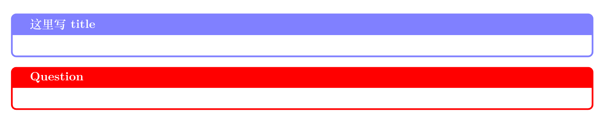

在科研中我通常需要整理一些笔记,虽然也想用iPad来整理,但是排版上总是不尽人意,字写得也不好看,所以干脆就整理一个`Latex`模板专门整理学习笔记.这篇Blog就是将自己的这个模板分享出来,主要还是基于[project-logbook](https://github.com/apalha/project-logbook)进行了一些改造.
{:.info}
<!--more-->
# 高亮块
想要将一些文字高亮起来,这里使用了一个`note`环境来实现
```latex
\begin{note}{title}{blue!50}
Text
\end{note}
```
第一个参数`title`就是用来设置高亮标题的,第二个参数则是控制高亮块的颜色.



可以通过修改颜色`blue!50`产生不同的颜色块,从而来对不同的内容进行高亮标记.
# 主文件
下面是主要的设置,其中需要使用自定义的样式控制`project-log.cls`,而且中间需要就行一些额外的设置,比如文档标题等
```latex
\documentclass{project-log}
\SetMaintainer{李玉轩}{yxliphy@bit.edu.cn}{北京理工大学} % 主要作者的id是main
%\CreateContributor{ccl}{第二作者身份}{第二作者姓名}{第二作者单位} % 第一个变量是贡献者id，后面直接使用就可以标记是哪个人对应的内容
\SetProjectTitle{组会笔记}
\SetProjectSubtitle{}
\SetProjectHeaderName{组会笔记}% 页眉内容
\SetProjectSummary{该文档主要整理了组会上的笔记} %文档介绍
\SetInstitutionLogo{figures/logo.png} % 文档logo
%\SetInstitutionLogo{logo} % 文档logo
%============================================
%\makeatletter
%\@namedef{ver@everypage.sty}{9999/99/99}
%\makeatother
%\usepackage{everypage-1x}
%\usepackage[contents=DRAFT, color=red, opacity=0.2]{background}
%\backgroundsetup{scale=0.5, angle=45, opacity = 0.1, contents = {\includegraphics[width=\paperwidth, height=\paperwidth, keepaspectratio]{back}}}
%\usepackage{draftwatermark}         % 所有页加水印
%\usepackage[firstpage]{draftwatermark} % 只有第一页加水印
%\SetWatermarkText{Draft}           % 设置水印内容
%\SetWatermarkText{\includegraphics{fig/texlion.png}}         % 设置水印logo
%\SetWatermarkLightness{0.9}             % 设置水印透明度 0-1
%\SetWatermarkScale{1}                   % 设置水印大小 0-1 
%====================================================================
% 自定义命令
\newcommand{\eq}[1]{\begin{equation} #1 \end{equation}}
\newcommand{\eqn}[1]{\begin{equation*} #1 \end{equation*}}
\newcommand{\eqa}[1]{\begin{equation}\begin{aligned} #1 \end{aligned}\end{equation}}
\newcommand{\eqna}[1]{\begin{equation*}\begin{aligned} #1 \end{aligned}\end{equation*}}
\newcommand{\hath}{\hat{H}}
\newcommand{\ua}{\uparrow}
\newcommand{\da}{\downarrow}
\newcommand{\ra}{\rightarrow}
\newcommand{\Ra}{\Rightarrow}
\newcommand{\bfk}{\mathbf{k}}
\newcommand{\bfr}{\mathbf{r}}
\newcommand{\bfq}{\mathbf{q}}
\newcommand{\kb}[1]{\langle #1 \rangle}
\newcommand{\T}{\mathcal{T}}
\newcommand{\tc}[1]{\textcircled{#1}}
\newcommand{\vr}{\vec{r}}
\newcommand{\ks}[1]{|#1 \rangle}
\newcommand{\bs}[1]{\langle #1 |}
%====================================================================
% Start the document
\begin{document}
%\pagenumbering{Roman}
\MakeFrontPage%  Front page
%\listoffigures % 图目录
%\listoftables
%\pagestyle{plain}
\newpage
\setcounter{page}{1}%当前页为第一页
%--------------------------------------------------------
\begin{note}{title}{blue!50}
	
	\end{note}
%-----------------------------------------------------------------------------------------
%参考文献
%\newpage
%\bibliography{mybib}%加入参考文献
%\bibliographystyle{unsrt}

\end{document}

```

# 样式控制
下面将完整给出样式控制的代码,即就是主文件模板所需要的的`project-log.cls`,其实没必要,但是这样可以方便我自己之后查看,修改自己的其他模板
```latex
%% 
%% Copyright 2022 Netherlands eScience Center
%% 
%% Licensed under the Apache License, version 2.0, See LICENSE for details.
%%

%% Identification
%%The class identifies itself and the LaTeX version needed
\def\@plbReleaseDate{2022/05/06}
\def\@plbVersion{0.1.0}
\NeedsTeXFormat{LaTeX2e}
\ProvidesClass{project-log}[\@plbReleaseDate, \@plbVersion]

%% Load base class
%\LoadClass[12pt, a4paper]{ctexart}% 支持中文,用XeLatex编译
\LoadClass[10pt, a4paper]{ctexart}% 支持中文,用XeLatex编译


% =========== General Formatting =============
\RequirePackage[a4paper, hmargin=2cm,vmargin=2.5cm, headheight=16pt]{geometry} % Margin sizes
\RequirePackage{fancyhdr} % Allows for nice header and footer
\RequirePackage{appendix} % Enables appendices
\RequirePackage[colorlinks = true,
linkcolor = blue,
urlcolor  = red!60,
citecolor = blue,
filecolor = cyan,
anchorcolor = blue]{hyperref}
\RequirePackage{xcolor} % Required for custom colors

%================Date=============================
\RequirePackage{datetime} %日期
%\renewcommand{\today}{\number\year 年 \number\month 月 \number\day 日}
\renewcommand{\today}{\number\year-\number\month-\number\day} % 自定义日期显示
% =============== Math ===============
\RequirePackage{amsmath} % Standard math packages
\RequirePackage{amsthm} % Math Theorems
\RequirePackage{amssymb} % Math Symbols
\RequirePackage{amsfonts} % Math Fonts
\RequirePackage{mathtools} % Extra math tools such as PairedDelimiter
\RequirePackage{upgreek} % Nice sigma => \upsigma
\RequirePackage{array} % Enables array features
\RequirePackage{siunitx} % For SI Unit easy formatting
\RequirePackage{titlesec}% 标题与段落间距
\RequirePackage{titletoc} % 目录设置
\RequirePackage{xeCJK} %字体设置
%\renewcommand{\songti}{\CJKfontspec{STSong}}% 华文宋体
%\setCJKmonofont{ FangSong }
\renewcommand{\baselinestretch}{1.5} %行间距1.5倍


% =============== Figures ===============
\RequirePackage{float} % Float features
\RequirePackage{graphicx} % Image insertion.
\RequirePackage{tikz} % Diagram and figure creation and rendering
\RequirePackage[americanvoltages, europeancurrents, americanresistors, cuteinductors]{circuitikz} % Circuit Graphics

% =============== Tables ===============
\RequirePackage{booktabs} % Horizontal rules in tables
\RequirePackage{float} % Required for tables and figures in the multi
\RequirePackage{multirow} % Combined rows in tables
\RequirePackage{multicol} % Combined columns in tables
\RequirePackage{colortbl} % Color cells
\RequirePackage{cite} % 参考文献引用设置
\def\@cite#1#2{\textsuperscript{[{#1\if@tempswa , #2\fi}]}}  % 设置文献引用,并让其上标显示


%\usepackage{longtable} % Tables than span multipages
% % =============== Algorithms ===============
\RequirePackage{algorithm} % Allows for algorithm description
\RequirePackage[noend]{algpseudocode}

% =============== Other ===============
\RequirePackage{ulem} % 下划线
\setlength {\marginparwidth }{2cm}
\RequirePackage[colorinlistoftodos]{todonotes} % useful for leaving todonotes
\RequirePackage{textcomp} %Text Com­pan­ion fonts

\RequirePackage{pdfpages} % Insert pdfs
\RequirePackage[most]{tcolorbox} % Color boxes for comment
\usepackage{enumitem}

\RequirePackage[compatibility=false, font={small}]{caption} % For custom caption environments
\RequirePackage{subcaption}

%% ========================================================================
\makeatletter
\def\toclevel@subsubsubsection{4} % 目录中使用点进行间隔，这里设置到了第四层目录
\def\l@subsubsubsection{\@dottedtocline{4}{4em}{10em}}
\makeatother

\setcounter{secnumdepth}{4} % 这里设置最多到第三层目录
\setcounter{tocdepth}{4}
\titlecontents{section}[0em]{\zihao{-3}\bf}{第\thecontentslabel 章$\quad$}{}{\titlerule*[5pt]{$\cdot$}\contentspage}
%[0em]调节目录中章节标号与左边距的距离
%---------------------------------
% 子章节目录间距等设置
\titlecontents{subsection}[2em]{\zihao{4}\bf}{\thecontentslabel $\quad$}{}{\titlerule*[5pt]{$\cdot$}\contentspage}

%\numberwithin{equation}{section}  %公式按照章节标号
%\renewcommand\thefigure{\thesection.\arabic{figure}}  %图片按章节标号
\makeatletter
\@addtoreset{figure}{section} % 制作图片目录
\renewcommand\theequation{\arabic{section}-\arabic{equation}} 
\renewcommand\thefigure{\arabic{section}-\arabic{figure}}  %图片按章节标号
\renewcommand{\figurename}{图}               % 对图表中的Fig进行中文翻译变为图,比如(fig1--->图1)
\renewcommand{\contentsname}{目$\qquad$录}           % 对Contents进行汉化为目录 
\renewcommand\listfigurename{插\ 图\ 目\ 录} % 对List of Figures进行汉化为插图目录
\renewcommand\listtablename{表\ 格\ 目\ 录}  % 对List of Tables进行汉化表格目录


%% =======================================================================
\ExplSyntaxOn

% Declare the contributors property
\prop_new:N \g_contributors_prop
\prop_new:N \g_contributor_keys_prop

% Define the contributors property id for easy iteration
\NewDocumentCommand{\CreateContributorKeys}{mm} {
	\prop_gput:Nnn \g_contributor_keys_prop {#1}{#2}
}

% Defines the command to add a contributor
% Usage:
%	\CreateContributor{key}{name}{id}{institution}
\NewDocumentCommand{\CreateContributor}{mmmm} {
	\prop_gput:Nnn \g_contributors_prop { #1-name } { #2 }
	\prop_gput:Nnn \g_contributors_prop { #1-id } { #3 }
	\prop_gput:Nnn \g_contributors_prop { #1-institution } { #4 }
	\CreateContributorKeys{#1}{#1}
}

% Creates a quick access LaTeX2e accessible command to contributor's name
% associated to a key
% Usage:
%	\ContributorName{key}
\NewDocumentCommand{\ContributorName}{m}{
	\prop_item:Nn \g_contributors_prop {#1-name}
}

% Creates a quick access LaTeX2e accessible command to contributor's id
% associated to key
% Usage:
% 	\Controbutorid{key}
\NewDocumentCommand{\Contributorid}{m}{
	\prop_item:Nn \g_contributors_prop {#1-id}
}

% Creates a quick access LaTeX2e accessible command to contributor's institution
% associated to key
% Usage:
% 	\ControbutorInstitution{key}
\NewDocumentCommand{\ContributorInstitution}{m}{
	\prop_item:Nn \g_contributors_prop {#1-institution}
}

% Creates an iterable function that allows looping over all contributors list.
% This enables constructing blocks with all contributors with operations applied to them.
% See \PrintContributorsList for an example
\NewDocumentCommand{\GetAllContributorKeys}{m}{
	\prop_map_inline:Nn \g_contributor_keys_prop {
		#1
	}
}

\ExplSyntaxOff

% Toy function to print the information of all contributors as an itemized list
% Usage:
%	\PrintContributorsList
\NewDocumentCommand{\PrintContributorsList}{}{
	\begin{enumerate}
		\GetAllContributorKeys{\item Key: ##1,\, Name: \ContributorName{##1}, id: \Contributorid{##1}, Institution: \ContributorInstitution{##1} }
	\end{enumerate}
}


\NewDocumentCommand{\SetMaintainer}{mmm}{
	\edef\MaintainerName{#1}
	\edef\Maintainerid{#2}
	\edef\MaintainerInstitution{#3}
	\CreateContributor{main}{#1}{#2}{#3}
}

% Start with the default author, the user needs to change it
\SetMaintainer{Name}{Id}{Institute of Physics}


%% ========================================================================
%% Project logbook cover: Project title, subtile, description, headers

%% Format page
\pagestyle{fancy}
\fancyhf{}
\setlength\parindent{0in}
\setlength\parskip{0.1in}

%% Header / Footer 
%\rhead{\textit{更新日期: \today}}
\rhead{更新日期: \today}
%\chead{\textsc{\ProjectHeaderName~Logbook}} 
\chead{\textsc{\ProjectHeaderName}} 
%\lhead{\textsc{\Maintainerid}} % 页眉左侧
\lhead{\Maintainerid}
\rfoot{}
\cfoot{\color{gray} \textsc{\thepage~/~\pageref*{LastPage}}} %页脚页码设置
\lfoot{}
\renewcommand{\headrulewidth}{1.5pt}  % 页眉与正文之间的水平线粗细
\renewcommand{\footrulewidth}{1.5pt}  % 页脚也正文之间的水平黑线
\fancyfoot[C]{第\thepage 页}  % 在页脚中间显示 第几页


% We define the project name (a longer name) and a (shorter) name for the header, it is also possible
% to define a subtitle for the project

% Sets the name to appear in the header of the document
% Usage:
%	\SetProjectHeaderName{A short project name}
\NewDocumentCommand{\SetProjectHeaderName}{m}{
	\edef\ProjectHeaderName{#1}
}


% The default header name
\SetProjectHeaderName{页眉显示内容}

% Sets the main tittle of the project
% Usage:
%	\SetProjectTitle{The longer name of the project containing more information}
\NewDocumentCommand{\SetProjectTitle}{m}{
	\edef\ProjectTitle{#1}
}
% The default title
\SetProjectTitle{文档主标题}

% Sets the subtitle of the project
% Usage:
% 	\SetProjectSubtittle{The subtitle of the project to appear below the title}
\NewDocumentCommand{\SetProjectSubtitle}{m}{
	\edef\ProjectSubtitle{#1}
}
% The default subtitle
\SetProjectSubtitle{文档副标题}

%% Sets the institution's logo (typically associated to the maintainer)
% The logo should be a pdf or png file, the size of the logo is set by constraining the height of the
% logo to 1cm, this works well for horizontal logos but not so well for tall logos, need to look into this
% further
% Usage:
%	\SetInstitutionLogo{/a/path/to/a/figure}
\NewDocumentCommand{\SetInstitutionLogo}{m}{
	\edef\InstitutionLogo{#1}
}

% By default the logo is set to empty, which will result in an automatically generated LaTeX example figure. If you 
% wish to have no logo, use a white figure
\SetInstitutionLogo{}

% Helper function to add the institution logo, not to be used in the document, only for internal use in the class
% Actually uses the logo definition (the file path) and places the figure on the top corner of the page (the cover page)
% Usage:
%	\AddInstitutionLogo
\NewDocumentCommand{\AddInstitutionLogo}{}{%
	\begin{tikzpicture}[remember picture,overlay]
		\node[anchor=north east,yshift=-2.0cm,xshift=-5cm]%
		at (current page.north east)
		{\ifthenelse{\equal{\InstitutionLogo}{}}{\includegraphics[height=3cm]{example-image-a}}{\includegraphics[height=3cm]{\InstitutionLogo}}};
	\end{tikzpicture}
}

% Helper function to add the project title to the cover page
% Usage:
%	\AddProjectTitle
\NewDocumentCommand{\AddProjectTitle}{}{
	\begin{minipage}[t][9cm][t]{\textwidth}
		\vspace{6cm}
		\begin{center}
			{\zihao{1}\textbf{\ProjectTitle}} 
			\\ \vspace{0.5cm}
			{\large{\ProjectSubtitle}}
		\end{center}
	\end{minipage}
}

% Set the project summary to appear on the front page
% Usage:
% 	\SetProjectSummary{The summary of the project should briefly describe the project in.a couple of lines, not more.}
\NewDocumentCommand{\SetProjectSummary}{m}{
	\edef\ProjectSummary{#1} 
}

% By default add gibberish
\SetProjectSummary{这里是你的文档简介}

% Helper function to add the project summary to the cover page
% Usage:
%	\AddSummary
\NewDocumentCommand{\AddSummary}{}{
	\begin{minipage}[t]{\textwidth}
		%\textit{N.B.: \ProjectSummary} 
		\textbf{\zihao{3} 文档简介:}\zihao{4} \ProjectSummary
		\newline
		\vspace{2.5cm}
	\end{minipage}
}

% Helper function to add the information of the maintainer to the cover page
% Usage:
%	\AddMaintainer
\NewDocumentCommand{\AddMaintainer}{}{
	\begin{minipage}[t][3cm][t]{\textwidth}
		\noindent {\zihao{2}\bf 整理人:} \newline\newline
		%\hspace*{2.0cm}
		{\zihao{3}
			\begin{tabular}{lll}
				\MaintainerName  & (\Maintainerid)  &  \MaintainerInstitution
			\end{tabular}
		}
	\end{minipage}
}


% Creates the front page. Adds the logo, title, subtitle, maintainer info, contributors info, and summary to the 
% cover page and then add the table of contents right after it
% Usage:
%	\MakeFrontPage
\NewDocumentCommand{\MakeFrontPage}{}{
	\AddInstitutionLogo
	\AddProjectTitle
	\newline
	\AddSummary
	\newline
	\AddMaintainer
	\newline
	\tableofcontents  % also add the table of contents
}


%% Section formating
% Add a new page for every new section
\newcommand{\sectionbreak}{\clearpage}

%% Referencing commands
%\newcommand{\secref}[1]{Section~\ref{#1}}
%\newcommand{\figref}[1]{Figure~\ref{#1}}
%\newcommand{\tabref}[1]{Table~\ref{#1}}
%\newcommand{\lstref}[1]{Listing~\ref{#1}}

\newcommand{\secref}[1]{章节~\ref{#1}}
\newcommand{\figref}[1]{图~\ref{#1}}
\newcommand{\tabref}[1]{表~\ref{#1}}
\newcommand{\lstref}[1]{列表~\ref{#1}}

%%%%%%%%%%%%
% CAPTIONS %
%%%%%%%%%%%%

%%%% Paragraph separation
%\setlength{\parskip}{.5em}

\numberwithin{equation}{section} % Number equations within sections (i.e. 1.1, 1.2, 2.1, 2.2 instead of 1, 2, 3, 4)
\numberwithin{figure}{section} % Number figures within sections (i.e. 1.1, 1.2, 2.1, 2.2 instead of 1, 2, 3, 4)
\numberwithin{table}{section} % Number tables within sections (i.e. 1.1, 1.2, 2.1, 2.2 instead of 1, 2, 3, 4)

\newcommand{\gm}[1] {\guillemotleft #1\guillemotright} %$ pretty <<sth>>$

%%%%%%%%%%%%%%%%%
% MATH COMMANDS %
%%%%%%%%%%%%%%%%%
\DeclarePairedDelimiter\paren{(}{)}%
\DeclarePairedDelimiter\bra{[}{]}%
\DeclarePairedDelimiter\curly{\{}{\}}%
\DeclarePairedDelimiter\abs{\lvert}{\rvert}%
\DeclarePairedDelimiter\norm{\lVert}{\rVert}%
\DeclarePairedDelimiter\floor{\lfloor}{\rfloor}%
\DeclarePairedDelimiter\ceil{\lceil}{\rceil}%

\DeclareMathSymbol{\umu}{\mathalpha}{operators}{0}


%%%%%%%%
% TikZ %
%%%%%%%%

\usetikzlibrary{shapes,arrows,fit,calc,positioning,automata,decorations.markings}

%%%%%%%%%%%%%%
% ALGORITHMS %
%%%%%%%%%%%%%%

% % Comment
% \renewcommand\algorithmiccomment[1]{%
	%   \hfill\ \eqparbox{COMMENT}{#1}%
	% }

% Multiline Comment
\newcommand\LONGCOMMENT[1]{%
	\hfill\ \begin{minipage}[t]{\eqboxwidth{COMMENT}}#1\strut\end{minipage}%
}
% Do while
\algdef{SE}[DOWHILE]{Do}{doWhile}{\algorithmicdo}[1]{\algorithmicwhile\ #1}%
\newcommand{\Break}{\State \textbf{break} }
\newcommand{\Yield}{\State \textbf{yield} }


%%%%%%%%%%%%
% LISTINGS %
%%%%%%%%%%%%


% Captioning
\AtBeginDocument{\numberwithin{lstlisting}{section}}  % Number listings within sections (i.e. 1.1, 1.2, 2.1, 2.2 instead of 1, 2, 3, 4)

% Colors
\definecolor{background}{gray}{.98}                 % Background color definition
\definecolor{comments}{RGB}{51,102,0}               % Comments   color definition
\definecolor{keywords}{RGB}{0,0,120}                % Keywords   color definition
\definecolor{keywords2}{RGB}{204,0,102}             % Keywords2  color definition
\definecolor{numbers}{RGB}{127, 0, 127}             % Keywords2  color definition
\definecolor{Maroon}{RGB}{128, 0, 0}

% General config
\lstset{
	frame=Ltb,
	framerule=0pt,
	aboveskip=0.5cm,
	framextopmargin=3pt,
	framexbottommargin=3pt,
	framexleftmargin=0.4cm,
	framesep=0pt,
	rulesep=.4pt,
	rulecolor=\color{black},
	%
	stringstyle=\ttfamily,
	basicstyle=\small\ttfamily,
	commentstyle=\itshape\color{comments},
	keywordstyle=\bfseries\color{keywords},
	%
	% numberstyle=\tiny,
	numberstyle=\small\ttfamily\color{gray},
	numbers=left,
	numbersep=8pt,
	numberfirstline = false,
	%
	breakatwhitespace=false,         % sets if automatic breaks should only happen at whitespace
	breaklines=true,                 % sets automatic line breaking
	captionpos=t,                    % sets the caption-position to bottom
	escapeinside={<@}{@>},            % if you want to add LaTeX within your code
	keepspaces=true,                 % keeps spaces in text, useful for keepingindentation of code (possibly needs columns=flexible)
	showspaces=false,                % show spaces everywhere adding particularunderscores; it overrides 'showstringspaces'
	showstringspaces=false,          % underline spaces within strings only
	showtabs=false,                  % show tabs within strings adding particularunderscores
	stepnumber=1,                    % the step between two line-numbers. If it's1, each line will be numbered
	tabsize=2,                       % sets default tabsize to 2 spaces
}

\makeatother
%% ========================================================================
%% record My note
	\newenvironment{note}[2]
	{
		\ifthenelse{\equal{#1}{}}{
			\begin{tcolorbox}[breakable, enhanced, colback=white!5,colframe=#2]
				\setlength\parskip{0.2cm}
			}
			{
\begin{tcolorbox}[breakable, enhanced, colback=white!5,colframe=#2,fonttitle=\bfseries, title=#1]
\setlength\parskip{0.2cm}
				}	
			}
			{
			\end{tcolorbox}
		}
```

