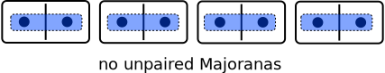
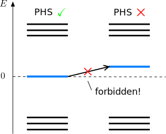

最近正好有些空闲的时间，发现自己对拓扑中的一些理解并不深刻，正好借这个机会重新学习一下，加深自己对其中内容的理解，也能让自己之后的研究走的更远。
{:.info}
<!--more-->

# Fermion parity switches

通常情况下，能级发生表明此时存在一个守恒量，但是对于上面随机产生的这个BdG哈密顿量似乎不是那么直观的可以知道这个守恒量到底是什么。这里就来回想一下前面说过的：**虽然在平均场处理下面，超导体中电子的数量不是一个守恒量，但是电子数量对应的宇称却是一个守恒量** 。换而言之就是说，在超导联系量子点中产生或者破坏一对Cooper对并不会影响系统中电子数目是奇数个还是偶数个，简而言之就是说**费米子的宇称是一个守恒量**.

  

通过上面的分析就知道了，在BdG哈密顿量随参数演化过程中，能级交叉意味着存在费米子宇称是一个守恒量，但是费米子宇称是一个多体无量，原则上是不能通过BdG哈密顿量这种单粒子的物理图像来理解的、为了理解这里存在的能级交叉，回想一下前面在得到BdG哈密顿量的过程，我们将体系的自由度翻倍了，在基矢$C$中同时考虑的电子和空穴，因此与子晶格对称性不同，一对能量为$\pm E$的能级交叉并不对应两个不同的量子态，它其实是**同一个**量子态。这个量子态是电子和空穴的叠加态，即*Bogoliubov quasiparticle*：它的激发能量为$E$，对应的产生算符为$a^\dagger = u c^\dagger + v c$。以能量$-E$填充其partner态和清空正能量态是一样的。**其实这里的能级可以交叉，就是能量为正和能量为负的态其实就是同一个量子态，只不过是因为在构建BdG哈密顿量的时候，人为引入了多余的自由度，所以这个时候看起来好像是有正负对称的能带，而其实能量为负的那一组完全是因为人为引入的冗余自由度导致的，可以认为它并不对应着新的量子态，而且在进行求解的时候，其实只要知道了能量为+E的态，就可以通过粒子空穴对称性来得到能量为-E的量子态。**

  

当一对能级在$E=0$处相交之后，Bogoliubov准粒子激发能量$+E$改变符号，变成有利于向超导量子点中加入一个Bogoliubov准粒子或者从超导量子点中将其移除。换句话说就是在每一次能级交叉时，量子点基态的费米子宇称会从偶宇称变成奇宇称，反之亦然。因此这些能级交叉其实对应的就是**费米子宇称切换**。

  

当没有Bogoliubov准粒子在对应的能级在$E=0$处相交时，超导哈密顿量的基态对应的费米子宇称是守恒的，基态的费米子宇称就是这个系统的拓扑不变量。然而，很明显，这个不变量与非超导系统的拓扑不变量性质不同，非超导系统是由哈密顿量的负特征值的数量给出的(占据态的数量)。后者对于具有对称能谱的Bogoliubov-de Gennes Hamiltonian不能改变，因此它不适合描述费米子宇称的变化。

  

# The Pfaffian invariant

为了介绍这个新的不变量，此时需要从最基本的变换开始，它可以将哈密顿量变成反对称矩阵。在粒子空穴空间中，利用下面的幺正变换

$$
\tilde{H}_{BdG}=\frac{1}{2}\left( \begin{array}{cc}
1 & 1 \\
i & -i \end{array} \right)
H_{BdG}
\left( \begin{array}{cc}
1 & -i \\
1 & i \end{array} \right)\,.
$$

可以得到

$$
\tilde{H}_\textrm{BdG} = \frac{1}{2}\begin{pmatrix} H-H^*+\Delta-\Delta^* & -iH-iH^*+i\Delta+i\Delta^* \\ +iH+iH^*+i\Delta+i\Delta^* & H-H^*-\Delta+\Delta^* \end{pmatrix}.
$$

在前面写出BdG哈密顿量的时候已经知道配对矩阵$\Delta$是反对称的，因为哈密顿量是厄米矩阵，所以$H-H^*$ 是反对称矩阵， $H+H^*$ 是对称矩阵，可以发现$\tilde{H}_\textrm{BdG}$此时是反对称矩阵，

  

对于反对称的矩阵，它有一个特殊的数可以反映其性质，即[Pfaffian](http://en.wikipedia.org/wiki/Pfaffian)。它的基本想法很简单：反对称矩阵的本征值总是成对出现的。对于现在考虑的哈密顿量$\tilde{H}_{BdG}$，因为体系是具有粒子空穴对称性的，所以其能谱总是成对出现的$\pm E$。将这些本征值乘起来就可以得到矩阵的行列式$\det[\tilde{H}_{BdG}]=\prod_n (-E_n^2)$ ，Pfaffian最重要的特征是它允许对行列式取平方根，结果为$\pm \prod_n iE_n$，在这种情况下面，乘积的符号是唯一确定的。在费米子宇称发生变化的时候，一个$E_n$将会改变符号，所以此时Pfaffian同样会跟着发生变化，但是行列式却不会发生变化。  

Pfaffian的这个特性确实使它成为我们正在寻找的东西。让我们试着用Pfaffian的符号作为拓扑不变量$Q_\textrm{BdG}$:

$$ Q_\textrm{BdG} = \textrm{sign}\left[\,\textrm{Pf} (i H_\textrm{BdG})\,\right]\,.$$

这里为了方便在哈密顿量前面乘以了虚数因子$i$，此时得到的Pfaffian就是一个实数。通过对上面给出的哈密顿量计算现在定义的拓扑不变量得到

此时可以发现，每一次能级在$E=0$处的相交，对应的Pfaffian就会从$-1\rightarrow +1$，所以此时就可以利用Pfaffian正确的反应超导系统中的拓扑相变，而$Q_{\rm BdG}$同样会反映系统基态的费米子宇称。

# Unpaired Majorana modes in one-dimensional systems
## Fermion operators and Majorana operators
这里先从费米型模型模式的产生算符$c^\dagger$和湮灭算符$c$开始。这些算符满足反对易关系

$$c^\dagger c + cc^\dagger = 1$$

而且它们的平方都是零

$$c^2=0\qquad (c^\dagger)^2=0$$

通过产生算符和湮灭算符可以将真空态$\rvert0\rangle$和激发态$\rvert1\rangle$联系起来

$$c \left|0\right\rangle = 0\quad c^\dagger\left|0\right\rangle=\left|1\right\rangle \quad c^\dagger \left|1\right\rangle = 0$$

当我们有一对$c^\dagger,c$算符之后，就可以将它们表示成下面的形式

$$
c^\dagger = \tfrac{1}{2}(\gamma_1+i\gamma_2),\;\; c = \tfrac{1}{2}(\gamma_1-i\gamma_2).
$$

这里的$\gamma_1,\gamma_2$就是Majorana算符。如果将上面的变换过程倒过来，将Majorana算符用电子算符$c^\dagger,c$表示出来，就会发现Majorana算符满足
$$\gamma_1=\gamma_1^\dagger,\gamma_2=\gamma_2^\dagger$$
由于这个特殊的性质，此时我们不能考虑单独一个Majorana模式是占据态的还是空态，此时与通常的电子态是截然不同的，这也就是Majorana模式特殊的地方。
{:.info}

虽然Majorana模式与通常的电子态是不同的，但Majorana算符仍然满足的是反对易关系

$$
\gamma_1\gamma_2 + \gamma_2\gamma_1 = 0\;,\;\gamma_1^2=1\;,\;\gamma_2^2=1\;.
$$

此时看起来Majorana费米子与通常的费米子又具有类似的属性。其实从上面构建Majorana费米子的过程中可以看到，它很像是将一个复数分解成了实部和虚部，实际上每一个费米子算符总是可以表示成两个Majorana费米子复合而成，这也就意味着Majorana模式总是成对出现的。

虽然对Majorana模式讨论占据态和空态是不合理的，但是这里总是可以将Majorana算符作用在电子的真空态$\rvert0\rangle$和占据态$\rvert1\rangle$上面的。如果电子的真空态和占据态之间的能量差为$\epsilon$，那么这两个二能极系统的哈密顿量可以表示为$H=\epsilon c^\dagger c$，利用上面构建Majorana算符的方法，可以将这个二能极系统的哈密顿量用Majorana算符表示出来

$$H=\tfrac{1}{2}\,\epsilon\,(1 - i\gamma_1\gamma_2)$$

这里可以单独存在一个孤立的Majorana模式吗？答案是否定的，凝聚态系统都是由电子组成的，而每个电子都会对应一对Majorana模式，此时这两个Majorana在空间中总是会绑定在一起，但是却可以设计哈密顿量具有某种特殊的形式让这两个Majorana模式在空间上分离开来，如果以局域的眼光来看，此时仿佛在某个区域内就会存在孤立的Majorana模式。

## Unpaired Majorana modes in a model of dominoes

这里来研究一下如何局域的产生Majorana模式。首先考虑一个1D的链，他具有$N$个个点位置，每一个个点上都可以占据一个费米子$c^\dagger$，等价的来说就是每个个点上都可以占据两个Majorana模式$\gamma_{2n-1}$ 和 $\gamma_{2n}$。如下图所示，考虑$N=4$的情形

如果将Majorana模式两两配对会发生什么？这意味着每个格点都占据一个费米子，此时的化学势为$\mu$，此时将哈密顿量表示在Majorana算符下面为

$$
H=(i/2)\,\mu\, \sum_{n=1}^{N} \gamma_{2n-1}\gamma_{2n}.
$$

Majorana模式的配对如下图所示

此时系统中的激发对应的能量为$\pm\rvert\mu\rvert/2$，整个链是有能隙的，在边界上也不存在零能态。很显然，这里并没有实现我们想得到局域孤立的Majorana模式，因此可以改变一下Majorana模式之间的配对方式。我们只想让每个边界端具有一个Majorana模式，所以将不同格点之间的Majorana配对起来，此时就会发现首尾两端的Majorana并不会存在相临且为配对的partner

对于以这种方式形成的每一个Majorana partner，我们在电子的空态和占据态之间赋予$2t$的hopping大小，从而得到在Majorana算符表示下的哈密顿量

$$
H=it \sum_{n=1}^{N-1} \gamma_{2n+1}\gamma_{2n}.
$$

此时可以发现首尾两端的Majorana模式$\gamma_1,\gamma_{2N}$并没有出现在哈密顿量中，因此这个链中具有存在两个孤立的Majorana零能模，分别具有在1D链的两端。那些不在1D链两端的态，具有的能量差为$\pm\rvert t\rvert$，而且与1D链的长度是没有关系的。因此在这种情况下，就在一个1D的系统中实现了有能隙的体态和边界上的零能态。

## The Kitaev chain model
在上面的讨论中，一直是在Majorana算符的表示下面讨论的，现在尝试将哈密顿量$H$表示在电子算符$c(c^\dagger)$下面。利用变换关系

$$\gamma_{2n-1}=(c_n^\dagger+c_n)\qquad \gamma_{2n}=-i(c_n^\dagger-c_n)$$

可以发现，前面讨论的两种Majorana模式配对的情形，其实对应的都是一个1D超导线在极限情况下的情形

$$
\begin{equation}
H=-\mu\sum_n c_n^\dagger c_n-t\sum_n (c_{n+1}^\dagger c_n+\textrm{h.c.}) + \Delta\sum_n (c_n c_{n+1}+\textrm{h.c.})\,.
\end{equation}
$$

这里有三个参数：占位能$\mu$，不同个点之间的hopping大小$t$，以及电子配对$\Delta$。**注意，这里$\Delta$项对应的产生成对的粒子是在相邻个点上发生的，而不是像$s$波配对一样发生在同一个格点上。** 从上面这个哈密顿量出发，当参数满足$\Delta=t$ 且 $\mu=0$，在系统两端就会存在未配对的Majorana模式，而在$\Delta=t=0,\quad \mu\neq 0$时，系统处于平庸相，不存在孤立的Majorana模式。

回想前面在讨论粒子空穴对称性时候，将超导哈密顿量表示为BdG哈密顿量的形式

$$H = \tfrac{1}{2} C^\dagger H_\textrm{BdG} C$$

这里的$C$是一个列矢量，其中包含了所有的电子产生算符和湮灭算符

$$C=(c_1, \dots, c_N, c_1^\dagger, \dots, c^\dagger_N)^T$$

利用Pauli矩阵$\tau$作用在粒子空穴空间中，可以将这个$2N\times 2N$的矩阵表示为更加紧凑的形式。$\rvert0\rangle$表示一个列矢量$(0,\dots,1,0,\dots)^T$对应着链的第$n$个位置。在这些简化符号的表示下可以得到

$$C^\dagger\,\tau_z\,\left|n\right\rangle\left\langle n\right|\,C = 2c_n^\dagger c_n-1$$

此时就可以将BdG哈密顿量表示为

$$
H_{BdG}=-\sum_n \mu \tau_z\left|n\right\rangle\left\langle n\right|-\sum_n \left[(t\tau_z+i\Delta\tau_y)\,\left|n\right\rangle\left\langle n+1 \right| + \textrm{h.c.}\right].
$$

将哈密顿量写成这种形式，它的基矢为$\left|n\right\rangle\otimes\left\rvert\tau\right\rangle$，这里$\tau=\pm1$对应的分别是电子和空穴态。BdG哈密顿量还具有粒子空穴对称性

$$\mathcal{P}H_\textrm{BdG}\mathcal{P}^{-1}=-H_\textrm{BdG}\quad\mathcal{P}=\tau_x\mathcal{K}$$

## Topological protection of edge Majorana modes

在Kitaev模型中，具有未配对的Majorana零能模是很有趣的事情。“未配对的马约拉纳出现是因为你选择了一组特定的、甚至可能是无法达到的参数!显然，通过设置$\mu=0$，此时已经从链的其余部分切断了第一个和最后一个Majorana模式。我敢打赌，如果只从零稍微改变$\mu$的值，零模式将耦合到链的其余部分并迅速消失。所以这些马约拉纳模式可能只是出现在这个高度调谐模型中的人工模型中!”
{:.info}

其实上面在分析存在未配对的Majorana模式的时候，选择的都是很特殊的极限情况，因为在这些极限情况下面，恰好是可以看到边界上的Majorana模式是孤立的，不存在耦合。其实通过调节参数可以发现，在一定参数区间内都是可以有稳定存在的Majorana的，只不过最终随着参数条件，会发生拓扑相变，在相变之后自然就不会存在孤立的Majorana模式了。

如上图所示，左边是实空间的能谱，右边的蓝色曲线对应的是in-gap states对应的波函数，红色曲线是第一激发态对应的波函数，随着化学势的缓慢变化，在一定的参数区间内都是存在零能量Majorana模式的，因此上面的Kitaev模型给出的边界态并不是在特定参数下存在一种偶然情形。从图中可以看到，随着化学势接近$\mu\sim 2t$的时候，两个零能态就会逐渐劈裂开，其对应的波函数也不再局域在边界上，而是演化到体态中。进一步增加化学势，最终这些态都会是体态，边界上就不存在低能激发了。其实在$\mu\sim 2t$对应的是一个体态能隙关闭的位置，这里会发生拓扑相变，自然相变之后就不会存在拓扑的Majorana模式。因此只要在参数演化过程中，体系的体态始终保持一个有限大小的能隙，那么拓扑态就始终是存在的。

下面来理解为什么这里需要体态能隙来保护拓扑态。当前所考虑的超导系统是具有粒子空穴对称性的，因此体系的能谱一定是关于$E=0$正负对称的。当化学势$\mu=0$的时候，存在两个零能Majorana模式，它们分别局域在系统的两端，而且与体态之间存在能隙。然而，单独的移动任意一个零能态是不可能的，因为这会违反粒子空穴对称性

因此唯一能移动零能态的方法就是将两个Majorana模式耦合起来(在实空间中耦合起来)，但是这两个Majorana模式是通过体态能隙分离开的，这种耦合是不可能实现的，那么唯一的方法就是当体态的"导带"和"价带"touch到一起，此时能隙为零，那么就可以将这两个零能态耦合起来了，而实现这个情况对应的就是调整化学势，当$\mu=2t$时就会发生体态能带touch的情况，就可以将Majorana耦合起来，从而相互湮灭(处在空间相同位置,可以认为两个Majorana模式会相互耦合，复合成一个普通的费米子)。

Isolated zero end-modes at each end in the Kitaev chain are protected by **symmetry** between positive and negative energy, and by the **absence of zero-energy excitations in the bulk of the wire**, but not by fine-tuning of the chain parameters.
{:.info}
